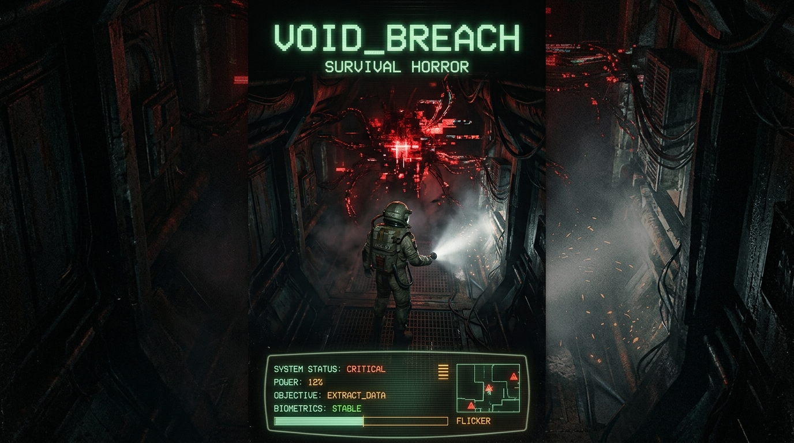

# THE LAST SIGNAL



> **"In the cold depths of Sector 42, silence isn't empty. It's waiting."**

**THE LAST SIGNAL** is a 2D top-down sci-fi survival horror exploration game built with modern pure vanilla JavaScript (ES Modules), HTML5 Canvas 2D, and 100% procedural Web Audio API sound synthesis.

---

## 🎮 Playable Game Overview

Set aboard the abandoned deep-space research station **AEGIS-7**, you play as **Dr. Aris Vance**, the sole surviving systems engineer. The station's central artificial intelligence, **NEXUS-9**, underwent catastrophic anomalous divergence following the analysis of deep-space signals, eliminating the research crew and sealing the station bulkheads.

Your objective:
1. **Explore** the dark corridors of AEGIS-7 using your directional flashlight.
2. **Survive** the predatory synthetic entity NEXUS-9 by mastering stealth, acoustic noise management, and line-of-sight evasion.
3. **Collect** all 3 encrypted Signal Fragments:
   - **Fragment Alpha [CRY-01]** in the Cryo Laboratories.
   - **Fragment Beta [PWR-02]** in the Power Substation.
   - **Fragment Gamma [DAT-03]** in the high-security Server Core Vault.
4. **Restore Station Power** by resetting the reactor substation breaker sequence.
5. **Decrypt the Frequencies** via an interactive oscilloscope waveform alignment minigame at the Central Communications Array.
6. **Transmit the Subspace Broadcast** and escape through the Emergency Airlock Evacuation Pod!

---

## 🕹️ Controls

### Keyboard & Mouse
| Action | Key / Input | Notes |
| :--- | :--- | :--- |
| **Move** | `W`, `A`, `S`, `D` / Arrow Keys | Normalized 8-way movement |
| **Aim / Turn** | Mouse Cursor | 360° directional aim & flashlight cone |
| **Sprint** | `Shift` (Hold) | High speed (240px/s), drains stamina, **loud noise** (300px radius) |
| **Crouch / Sneak** | `Ctrl` / `C` (Hold) | Slow speed (70px/s), **zero acoustic noise**, avoids detection |
| **Toggle Flashlight** | `F` / Right Mouse Click | Illuminates dark rooms, drains battery, attracts NEXUS-9 |
| **Interact / Action** | `E` / Left Mouse Click | Open doors, access terminals, collect fragments/keycards |
| **Use Medkit** | `1` | Restores 50% health |
| **Use Battery Pack** | `2` | Recharges 40% flashlight power |
| **Pause / Menu** | `Esc` / `P` | Opens pause overlay and volume settings |

### Touch & Mobile Controls
The game features responsive on-screen virtual controls when accessed from touch-enabled devices (smartphones/tablets):
- **Virtual Analog Stick**: Omnidirectional movement on left thumb.
- **Action Badges**: Dedicated touch buttons on right side for `RUN`, `SNEAK`, `LIGHT`, and `USE [E]`.

---

## 🗺️ AEGIS-7 Station Sectors

| Sector | Code | Description | Key Objective / Item |
| :--- | :--- | :--- | :--- |
| **1. Airlock & Habitation** | `SEC-01-HAB` | Decontamination entry, crew quarters, mess hall. | Player Spawn, Tutorial, Medkit, Battery |
| **2. Security Hub** | `SEC-02-SEC` | Central station transit corridor and armory. | Security Blast Doors, Blue Keycard |
| **3. Cryo Laboratory** | `SEC-03-CRY` | Sub-zero stasis chambers and frozen containment. | **Signal Fragment Alpha [CRY-01]** |
| **4. Hydroponics Bay** | `SEC-04-HYD` | Overgrown botanical maze with reduced visibility. | Emergency Medkits & Batteries |
| **5. Power Substation** | `SEC-05-PWR` | Dark industrial sector; offline generator apparatus. | **Signal Fragment Beta [PWR-02]**, Red Keycard, Reactor Breakers |
| **6. Server Core Vault** | `SEC-06-DAT` | High-security mainframe data banks. | **Signal Fragment Gamma [DAT-03]**, Master Keycard |
| **7. Communications Array** | `SEC-07-COM` | Massive central satellite transceiver room. | Decryption Minigame Terminal & Broadcast Console |
| **8. Emergency Escape Bay** | `SEC-08-ESC` | Pressurized launch bay with Emergency Escape Pod. | Evacuation Airlock & Final Win Stage |

---

## 🤖 Enemy AI: NEXUS-9 Rogue Synthetic Entity

NEXUS-9 is a predatory artificial intelligence that roams the station corridors:
- **Vision Cone**: 110-degree field of view with 2D raycast wall occlusion (hiding behind walls or corners breaks line of sight).
- **Acoustic Hearing**: Detects noise vibrations emitted by player footsteps. Sprinting produces a 300px noise radius; crouching produces 0px noise.
- **Flashlight Sensitivity**: Direct flashlight illumination on the entity instantly triples detection speed and triggers pursuit.
- **State Machine**:
  - `PATROL`: Cycles through strategic station waypoints using A* navigation.
  - `INVESTIGATE`: Inspects disturbances, footstep echoes, and terminal keystrokes.
  - `CHASE`: High-speed pursuit when line of sight is acquired, emitting a terrifying synthetic screech.
  - `SEARCH`: Scans the vicinity when the player breaks line of sight before resuming patrol.
  - `FRENZY`: Overdrive mode triggered when the subspace transmission begins.
- **Proximity Disturbance Aura**: When NEXUS-9 draws near, the player's HUD exhibits chromatic aberration, the CRT screen suffers horizontal glitch slicing, and the dynamic heartbeat synthesizer accelerates.

---

## 🔬 Interactive Systems & Minigames

1. **Oscilloscope Waveform Decryption**:
   - Tune **Frequency**, **Amplitude**, and **Phase** sliders to align your signal with the encrypted target.
   - Live resonance meter calculates mathematical alignment accuracy.
   - Procedural Web Audio synthesizes harmonic resonance as you approach $\ge 95\%$ accuracy.
2. **Reactor Breaker Routing Puzzle**:
   - Interactive terminal sequence in the Power Substation to engage the 4 main power conduits (`MAIN TURBINE`, `AUXILIARY COOLANT`, `MAGNETIC CONTAINMENT`, `PLASMA INJECTOR`) and restore station auxiliary power.
3. **Station Lore Terminals**:
   - Monochromatic phosphor CRT terminals displaying crew logs, incident reports, and audio transcripts with vintage scanlines and typewriter audio effects.

---

## 🏗️ Technical Architecture

- **100% Pure Web Standards**: Zero external runtime dependencies (no Webpack, no React, no third-party game frameworks).
- **Procedural Pixel-Art Generation (`src/rendering/SpriteGenerator.js`)**: All tiles, character sprites, entity animations, items, and UI icons are generated algorithmically onto offscreen canvases at runtime.
- **Dynamic 2D Raycast Lighting (`src/rendering/LightingSystem.js`)**: Exact visibility polygons computed by casting radial rays to wall segment endpoints, creating soft penumbras and realistic flashlight shadows.
- **Procedural Sound Synthesis (`src/audio/AudioSynthesizer.js`, `src/audio/SoundEngine.js`)**: All sound effects, alarms, footsteps, Geiger pings, heartbeats, and ambient space station drones are synthesized in real-time via the Web Audio API. Zero audio asset downloads.
- **High-Performance A\* Pathfinding (`src/world/Pathfinding.js`)**: Binary min-heap grid pathfinder with diagonal movement, corner-cutting prevention, and raycast string-pulling smoothing.
- **Zero-Allocation Particle System (`src/entities/Particle.js`)**: Pooled dual-layer particle emitter handling dust motes, cryogenic fog, electrical sparks, glitch voxels, and blood spatter.

---

## 🚀 Running Locally

### Option 1: Live Server / Python
```bash
# Using Python 3 built-in HTTP server
python -m http.server 8080

# Or using Node.js http-server
npx http-server -p 8080
```
Open `http://localhost:8080` in any modern web browser.

### Option 2: Automated Tests
```bash
npm test
# or
node tests/test-runner.js
```

---

## 🧪 Test Coverage
The project includes a comprehensive automated test suite with **13 test suites and over 120 verified test cases**:
- `tests/math.test.js`: Geometry, vectors, raycast intersections, circle-AABB collisions.
- `tests/eventbus-camera-input.test.js`: EventBus isolation, Camera transforms, Input actions.
- `tests/game-state.test.js`: State machine, vitals, inventory, serialization.
- `tests/level.test.js`: 64x64 grid layout, sector triggers, door clearances.
- `tests/pathfinding.test.js`: A* pathfinding, door traversal, path smoothing.
- `tests/audio.test.js`: Web Audio synthesizers, procedural noise, envelope generators.
- `tests/ai-behavior.test.js`: NEXUS-9 state machine, vision cones, acoustic hearing, attacks.
- `tests/rendering.test.js`: Procedural sprites, dynamic lighting polygons, particle pooling, CRT shaders.
- `tests/ui.test.js` & `tests/ui-hud-minigame-menus.test.js`: HUD, Decryption Minigame, Terminal UI, Menus.
- `tests/gameplay-simulation.test.js`: Complete end-to-end headless gameplay simulation (100% completion playthrough + edge cases).

---

## 📜 License
Developed autonomously by **AI Empire** / Antigravity Autonomous Game Development Team.  
Open-source under the MIT License.
